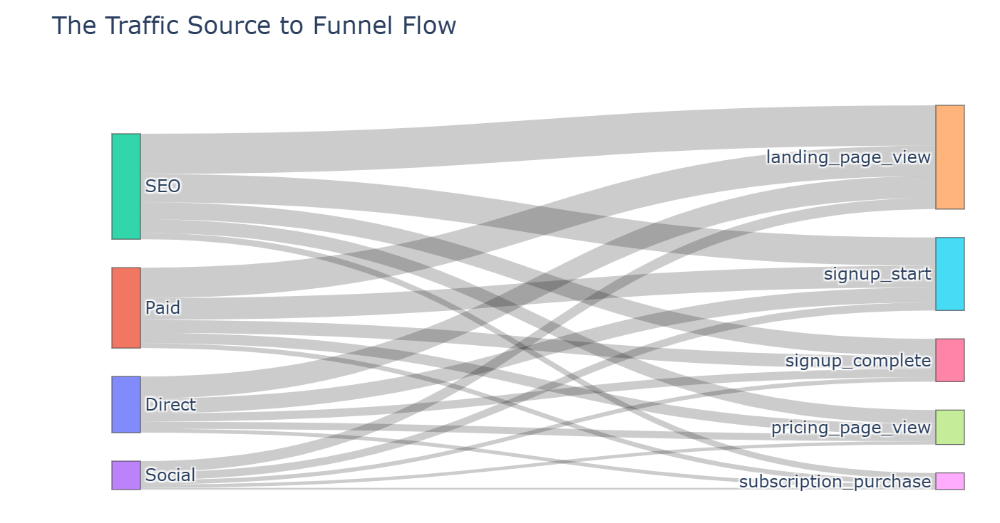

Below is a selection of data science projects demonstrating my end-to-end capabilities, from raw data engineering to statistical **modeling** and stakeholder presentation.

---

## 1. Credit Card Customer Segmentation {#credit-card}

{width=80% fig-align="center"}

**Tools:** Pandas, NumPy, Matplotlib, Seaborn, Scikit-learn, Kneed
**Status:** Ongoing Research

### The Challenge
Credit card companies struggle to **personalise marketing** or **identify risk** within diverse, unlabelled datasets. The challenge was to uncover **natural customer groupings** using unsupervised learning to reveal hidden **behavioural patterns** and improve retention

### The Solution
A full **unsupervised learning pipeline** was developed to discover meaningful customer segments. The approach included:

* Applying multiple **clustering algorithms**
* Identifying representative **customer profiles** for each segment

This strategy ensured robust segmentation and deeper insight into customer behaviour.

### Key Technical Achievements
* Built a full clustering pipeline (K‑Means, DBSCAN, GMM, HCA) with robust **preprocessing** and **scaling**.
* Identified **K‑Means** as the optimal model (Silhouette Score: 0.32), while detecting that DBSCAN and GMM failed to form distinct clusters on this dataset.
* Evaluated models using **silhouette scores**, **inertia**, PCA **visualisations**, and the **Davies-Bouldin Index**.
* Produced clear customer segments with actionable **business insights**.

### Code Snapshot
*A snippet demonstrating the **initialization** of the location and model parameters:*

```python

#| code-summary: "View Hybrid PCA Code"
from sklearn.decomposition import PCA
from sklearn.preprocessing import StandardScaler
import numpy as np
import pandas as pd

# 1. Retain critical features, that are essential for risk profiling (Ensures interpretability)
direct_features = ['ONEOFF_PURCHASES', 'BALANCE', 'PAYMENTS','CREDIT_LIMIT', 'CASH_ADVANCE']
remaining_features = [col for col in df3.columns if col not in direct_features]

# 2. Apply PCA only to the redundant features
pca = PCA(n_components=6) # Retaining 95% variance
principal_components = pca.fit_transform(scaled_remaining_features)

# 3. Combine critical Features + PCA Components
final_data = np.hstack([scaled_direct_features, principal_components])
final_df = pd.DataFrame(final_data, columns=direct_features + [f'PC{i+1}' for i in range(6)])
```

---

## 2. Global Rehabilitation Analysis {#global-rehab}
**Tools:** Power BI, SQL, DAX
**Status:** Ongoing Research

### The Challenge
Global health systems lack clear, accessible insight into **rising rehabilitation needs**. Disease burden varies widely across regions and conditions, yet policymakers struggle to interpret complex DALY data and identify where services are most needed. The challenge was to turn **high‑dimensional global health metrics** into clear, trends,and find gaps in the system—through interactive, Power BI dashboards.

### The Solution
Full unsupervised learning pipeline to discover meaningful customer segments. The approach included:

**Extracting and transforming data using SQL.**
**Developing dynamic DAX measures for real-time analysis.**
**Designing user-friendly dashboards for non-technical stakeholders.**

This strategy ensured robust segmentation and deeper insight into customer behaviour.

### Key Technical Achievements
* **Transformed complex health datasets into an intuitive relational data model.**
* **Implemented advanced DAX calculations to quantify disease burden across varying demographics.**
* **Designed interactive visuals (maps, heatmaps) to highlight regional disparities.**
* **Enabled stakeholders to drill into specific conditions and geographies instantly.**

### Power BI Snapshot
*Executive summary with KPIs- Loading...*

<object data="assets/Global_Rehabilitation_Analysis.pdf" type="application/pdf" width="100%" height="600px">
    <p>Unable to display PDF file. <a href="assets/Global_Rehabilitation_Analysis.pdf">Download</a> instead.</p>
</object>

---

## 3. Web Funnel & A/B Testing Analysis {#web-funnel}
{width=80% fig-align="center"}

**Tools:** Python, Pandas, Plotly, SciPy
**Status:** Completed

### The Challenge
Web products often collect large volumes of event‑level data, yet teams struggle to interpret how users move through the conversion journey. Identifying where users **drop off**, which traffic sources bring **high‑intent** visitors, and whether product variants improve conversion requires structured analysis. The challenge was to transform raw event logs into a clear funnel model and evaluate product performance using statistical methods.

## The Solution
A full analytical workflow to model user progression and assess variant effectiveness. The approach included:

**Constructing a multi‑step conversion funnel.**
**Quantifying drop‑off rates and source‑level conversion performance.**  
**Evaluating product variants using Chi‑Square testing and Bayesian inference.**

This provided a transparent view of user behaviour and a statistically grounded assessment of the A/B experiment.

### Key Technical Achievements
* **Built a structured funnel model to measure user progression and identify major drop‑off points.**

* **Calculated conversion rates across acquisition sources to assess traffic quality.**

* **Implemented both frequentist and Bayesian A/B test frameworks for robust variant evaluation.**

* **Developed interactive visualisations (Sankey diagrams, bar charts) to communicate findings effectively.**

---

### Code Snapshot
*Code shows how the Frequentist Evaluation was implemented*

```python

#| code-summary: "Chi‑Square A/B Test Code"
from scipy.stats import chi2_contingency
import pandas as pd

# 1. Build exposure and conversion table for each variant
table = [
    [ab_df.loc["A", "converted"], ab_df.loc["A", "exposed"] - ab_df.loc["A", "converted"]],
    [ab_df.loc["B", "converted"], ab_df.loc["B", "exposed"] - ab_df.loc["B", "converted"]],
]

# 2. Run Chi‑Square test to evaluate statistical significance
chi2, p, dof, expected = chi2_contingency(table)

# 3. p-value interpretation:
*p < 0.05 → statistically significant difference*
*p ≥ 0.05 → no evidence that variants differ*

p
```

---